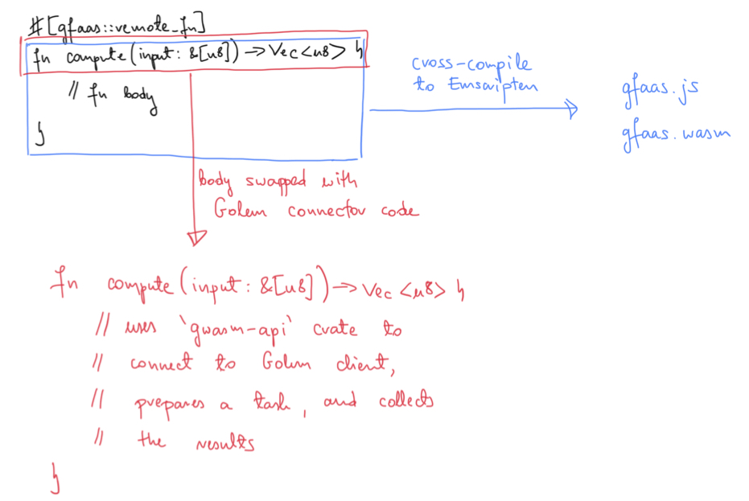

# Motivation for function-as-a-service using gWasm on Golem

Why gWasm function-as-a-service or _gfaas_ and yet another tool for automatically
spawning gWasm tasks? It is true that Golem already has two options at programmatically
(and idiomatically) spawning gWasm tasks from Rust, namely, via the use of [`gwasm-api`]
and [`gwasm-dispatcher`]. However, the former assumes that we have the appropriate
Wasm module precomputed upfront and statically linked with our app, and the latter that
the entire program is cross-compiled to Wasm. _gfaas_ aims at briding the gap between
the two in the sense that you can have the main bulk of your app compiled to the native
code, and have only minimal snippets of code, that require hefty computing resources,
cross-compiled to Wasm and launched on the Golem Network as gWasm tasks.

[`gwasm-api`]: https://github.com/golemfactory/gwasm-rust-api
[`gwasm-dispatcher`]: https://github.com/golemfactory/gwasm-runner/tree/master/gwasm-dispatcher

## Example usage

__DISCLAIMER__

    The following on-paper demonstration is a true representation of the current
    state of the project, however one has to prepare for some unexpected failures and bad error
    handling which are intended to be taken care of before the beta release. Also note
    however that the usage might change slightly.

The best way to demonstrate how _gfaas_ is intended to be used is in a simple example app
(_note_ you can find the full source code of the app in the [examples/hello] directory).

[examples/hello]: https://github.com/kubkon/gfaas/tree/master/examples/hello

In order to start using _gfaas_, you need to add the following dependency to your crate:

```
gfaas = "0.1"
```

_Note_ that the `gfaas` is not yet published on [crates.io], so in order to experiment
with it locally on your machine, you'd need to make `gfaas` a git dependency
(`gfaas = { git = "https://github.com/kubkon/gfaas" }`). This is only temporary
until `gfaas` and all required crates are published on [crates.io], which will obviously
happen before the beta release.

[crates.io]: https://crates.io

With that out of the way, we can now write things like:

```rust
// This function will be converted into a valid gWasm task, and computed on Golem
// Network. It's a very minimal example which will convert the input byte slice
// into a valid Unicode string, make it uppercase, and return as vector of bytes.
#[gfaas::remote_fn]
fn compute(input: &[u8]) -> Vec<u8> {
    let as_str = std::str::from_utf8(input).expect("valid Unicode");
    let uppercase = as_str.to_uppercase();
    uppercase.as_bytes().to_vec()
}

fn main() {
    let input_text = "hey there golem!";
    let output_bytes = compute(input_text.as_bytes());
    let output_text = String::from_utf8(output_bytes).expect("valid Unicode");
    assert_eq!(&output_text, "HEY THERE GOLEM!")
}
```

This snippet will automatically set up all machinery required to speak with
co-located Golem client on the same host, extract the contents of the function
annotated with `#[remote_fn]` attribute and convert it to a gWasm task (compiled
to Emscripten Wasm module). The user is only required to have the Golem client
up and running, and that's it!

How can one build and run this snippet? Well, it couldn't have been easier than
to use our custom `gfaas` cli tool that takes from notable (and similar) tools
in the domain such as `wasm-bindgen` and `cargo-wasi`. With the tool, you then
simply run:

```
$ gfaas build --release
$ gfaas run --release
```

And voila! There is no longer any need for invoking custom `cargo build` commands
with different targets such as `wasm32-unknown-emscripten`. It is all taken care of
for you by the `gfaas` tool.

I should note here that in the future we plan on making `gfaas` do virtually _all_
of heavy lifting for the user including auto-installation of the required Rust
compiler `1.38.0`, the matching target `wasm32-unknown-emscripten`, etc. After all,
the user shouldn't care about these at all.

## Behind-the-scenes shenanigans

The convenience described above is achieved thanks to power offered by Rust's
procedural macros. While generally unhygienic, they make things like `gfaas` possible.
In this particular case, the attribute `#[gfaas::remote_fn]` unwraps into a function
with the same signature, however, its body substituted with actual Golem client
connector code (uses `gwasm-api` crate). The original function body, which is meant
to be executed on the Golem Network, is extracted and cross-compiled to Emscripten
Wasm behind-the-scenes. This is depicted in the diagram below.



The fact that we cross-compile the function body to Wasm in the background as the
compilation of the app to native architecture is happening is the reason we use
a standalone compilation tool `gfaas`. Thanks to this we achieve some sense of
hygiene when working out all this magic.

## Benefits

This approach offers a couple notable benefits over the existing approaches. Firstly,
it doesn't require the entirety of the app cross-compiled to Wasm which allows
us to use multithreading since we're not limited to Wasm's single-threaded model
(this argument is not expected to hold forever since threads are in advanced state
of design for Wasm as we speak). Secondly, this demonstrates that Golem and gWasm
can be used as function-as-a-service (FaaS) providers, where only heavy-in-computation
chunks of the app are distributed over the Golem Network. Finally, while the current
state-of-the-art uses blocking calls for the remote functions, in the near future,
they should be converted to `async` calls making this a true FaaS solution where
the main thread of the app is not actively blocking on the heavy-computation result
but rather doing other meaningful work in the meantime, and only receiving the results of
computation when they're ready.